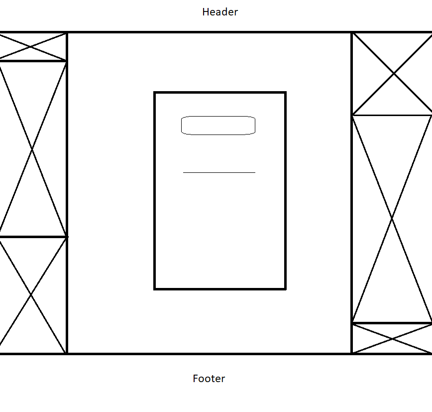
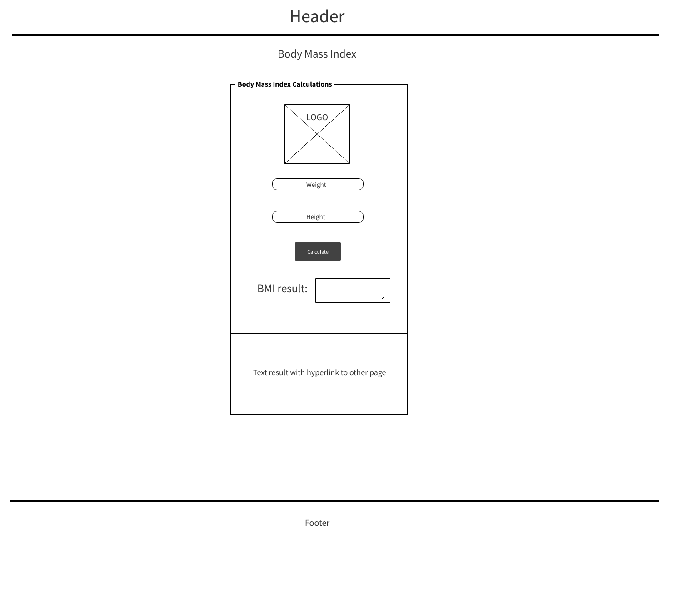
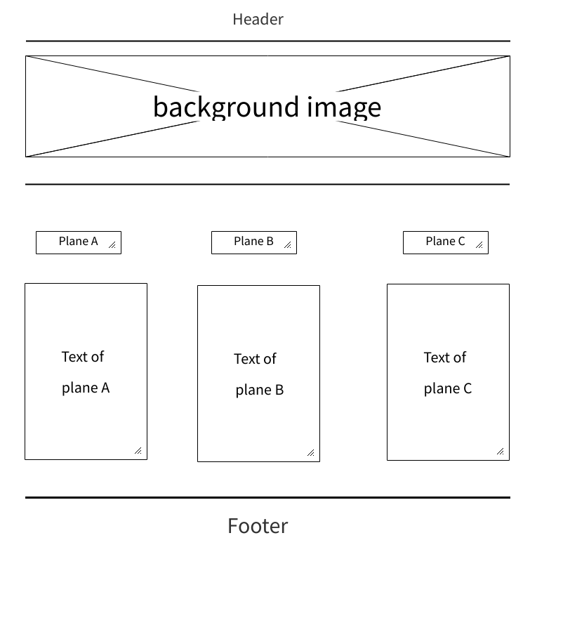
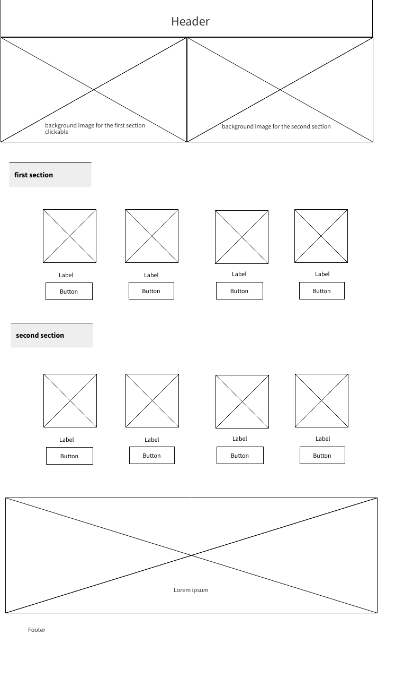
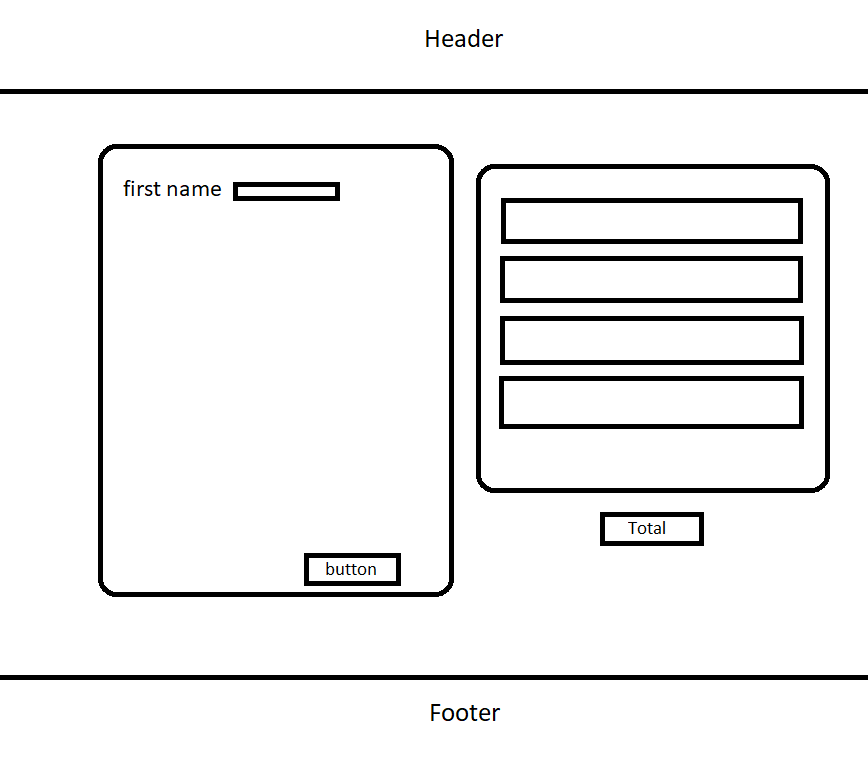

# PurePowerGym

## Collaborators of The Booleans Team:

* Team leader :   
**- Rami Zregat**
* Team Members:   
  
  **- Aseel Al-Saqer**  

  **- Hamzeh Banymelhem**  

  **- Yahia Labib**

  **- Bashar Al-Damen**  

## intro
Regular exercise helps control weight when use with a balanced diet. Regular physical activity can help you prevent or manage a wide range of health problems and concerns, including stroke, metabolic syndrome, type 2 diabetes, depression, and certain types of cancer, arthritis and falls. Regular training helps reduce stress and improves moods. Regular weight training can improve muscle mass.

## Problem Domain:
According to the latest studies regarding to weight people in jordan preform bad habits that affect their healthy life.
We want to help them live a fit and healthy lifestyle! We do this by helping them find the most suitable equipments and tools,healthy diet plans,and we help them achieve healthy lifestyle and fitness goals in mind. We stock a wide range of gym equipment, with strength equipment, cardio, cross training and so much more.
Our awesome team is always keen to help, so please check our website to fill  your needs.

## Wireframe:

